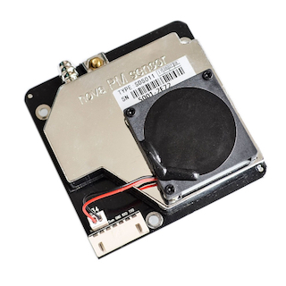
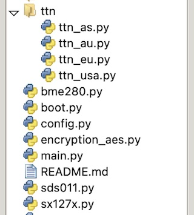

# LoRaWAN Weather station created for [VarnaLab](https://www.varnalab.org) in Micropython

За български език [ТУК](README_BG.md)

This project uses the following libs:

1. LoRaWAN for micropython: [here](https://github.com/lemariva/uPyLoRaWAN/tree/LoRaWAN)
2. SDS011 micropython driver: [here](https://github.com/g-sam/polly)
3. BME280 micropython driver: [here](https://github.com/robert-hh/BME280)

## Components

1. **SDS011**
dust sensor

2. **BME280** 
temperature, pressure and humidity sensor 

3. **Microcontroller** [LILYGO TTGO LORA32](http://www.lilygo.cn/prod_view.aspx?TypeId=50060&Id=1326&FId=t3:50060:3)

## Pinout

## Connections

bmе280 works over I2C bus. Connect to the following MCU pins **sda = 21, scl= 22**

Dust sensor works over UART. Connect to the following MCU pins **rx = 16, tx = 17**

## Configurations settings

Wifi and  [The Things Network](https://console.cloud.thethings.network) settings are located in the file [config.py](config.py) 
You have to create a device in TTN. It works only with ABP authentication since micropython driver doesn't support OTA.
The file [ttn_payload_formatter_function.js](ttn_payload_formatter_function.js) contains а javascript function which formats the payload for TTN processing. This function has to be put in the following place in TTN:

> __Applications > [your application] > End devices > eui-[your device id] > Payload formatters > Uplink__

This function is made to work with the struct, located in the MCU code.

## File upload

It is important to upload the files on the MCU with the following file structure:

## Extras (Bluetooth)

There is a class ([esp32ble.py](extras/esp32ble.py)) in Extras folder, which class allows using the esp32 bluetooth. I still haven't implemented it in the [main.py](main.py) file, but it can be used for UART debug, while the weather station is working. There is [sample code](extras/example_lora_ble_uart.py) in the same folder.
