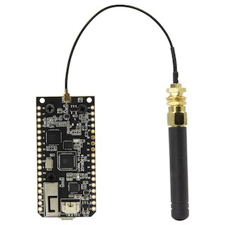
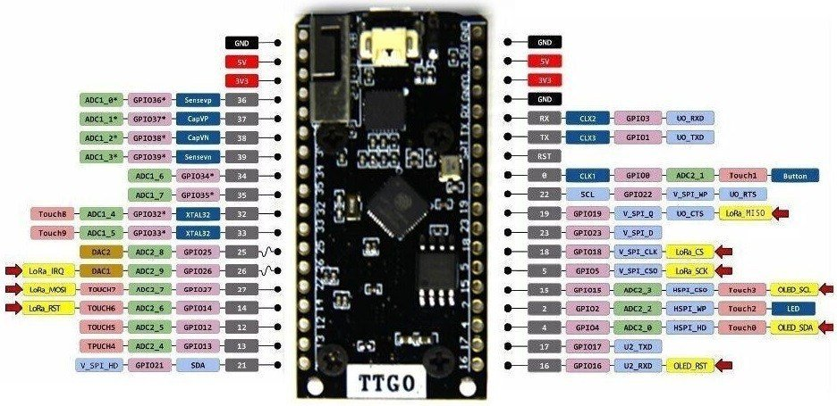

# Метеостанция на [VarnaLab](https://www.varnalab.org) с LoRaWAN и Micropython

Проекта ползва следните библиотеки:
1. LoRaWAN за micropython: [тук](https://github.com/lemariva/uPyLoRaWAN/tree/LoRaWAN)
2. SDS011 драйвер за micropython: [тук](https://github.com/g-sam/polly)
3. BME280 драйвер за micropython: [тук](https://github.com/robert-hh/BME280)

## Компоненти

1. **SDS011**
сензор за фини прахови частици

2. **BME280** 
сензор за температура, налягане и влажност

3. **Микроконтролер** [LILYGO TTGO E32](http://www.lilygo.cn/prod_view.aspx?TypeId=50060&Id=1326&FId=t3:50060:3)

 Итеглете специфичният фърмуер за микроконтролера LilyGo от [тук](https://micropython.org/download/LILYGO_TTGO_LORA32/)

## Диаграма на пиновете

## Свързване

Сензора bmе280 се свързва по I2C на следните пинове на микроконтролера **sda = 21, scl= 22**

Сензора за прах се свързва по UART на следните пинове на микроконтролера **rx = 16, tx = 17**

## Настройки на конфигурацията

Във файла [config.py](config.py) се намират полетата за wifi настройка, както и настройките за [The Things Network](https://console.cloud.thethings.network)
В TTN трябва да създадете устройство, което работи само с ABP автентикация, понеже драйвера за микропитон не подържа OTA.

Файлът [ttn_payload_formatter_function.js](ttn_payload_formatter_function.js) съдържа javascript, който форматира данните в TTN. Функцията от този файл трябва 
да се сложи в полето намиращо се в

> __Applications > [вашето приложение] > End devices > eui-[айди на вашето у-во] > Payload formatters > Uplink__

Тази функция е настроена да работи с формата на struct-a от кода на микроконтролера.

## Ъплоудване на файловете

Важно е да сложите на микроконтролера следните файлове в посочената файлова структура:

## Екстри (Блутуут)

В папка Extras има клас ([esp32ble.py](extras/esp32ble.py)), който позволява ползването на блутут-а на esp32. Още не съм го имплементирал в главният 
[main.py](main.py), но може да се ползва за UART дебъг докато станцията работи. Има [примерен код](extras/example_lora_ble_uart.py) в същата папка.

## Екстри (MQTT)

Във фърмуера на LilyGo няма преинсталиран umqtt модула, затова трябва да го добавим. Сложете цялата директориа umqtt заедно със съдържанието ѝ на микроконтролера.
